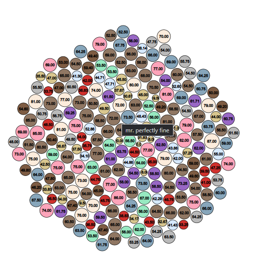
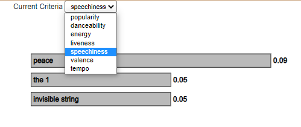

# swiftiedata
# Data Analysis of Taylor Swift's Eras
## Overview and Motivation 
Taylor Swift is one of the most famouse popstars today and is known fro experimenting with new music styles. Using data from Spotify, this project follows Taylor through her albums and compares metrics of popularity, danceability, energy, liveness, speechiness, valence, and tempo.  
## Goals and Tasks 
The main goal of this visualization is to have fun exploring data on a topic that is interesting to me. Usage scenarios for this project is comparing metrics between Taylor's songs and albums. It allows us to see how her songs compare to one another on both the album and career side. The questions you can answer with this visualization is what are Taylor's most popular songs, most danceable songs, most energetic songs, most live songs, most speechy songs, most valent songs, and most tempic songs. 
* Taylor Swift's most popular song is "Dont Blame Me". 
* Taylor Swift's most danceable song is "I Think He Knows"
* Taylor Swift's most energetic song is "I'm Only Me When I'm With You"
* Taylor Swift's most live song is "Karma" 
* Taylor Swift's most speechy song is "I Forgot That You Existed" 
* Taylor Swift's most valent song is "Shake It Off" 
* Taylor Swift's most tempic song is "Soon You'll Get Better"
## Data
The data used is sourced from a Kaggle dataset that pulled Spotify data for music from Taylor Swift. The data was cleaned in Python to exclude duplicates, karaoke versions, and radio specials. Then, as several albums are available in multiple versions, like deluxe or platnium editions, a new column called "era" was used to group unique songs. Song names were normalized to group them together, cutting off labels such as "acoustic version" or "ft. Lana Del Ray", and removing capital letters to account for re-releases with different punctuation. Then average metrics were used to aggregate the data across albums with multiple version. 
Description of attributes, provided by Spotify: 
* accousticness: confidence measure from 0-1 determining if a song is acoustic. 1.0 is high confidence and 0 is very low confidence 
* danceability: determines how danceable a song is based on musical elements like tempo, rhythm stability, beat strength, and regularity. 0 is least danceable and 1.0 is most danceable. 
* duration_ms: shows the length of the song in milliseconds. 
* energy: represents a perceptual measure of intensity and activity, quantifying how fast, loud, or noisy a track is, 0.0 to 1.0, with 1 being most energetic. 
* instrumentalness: predictor of the amount of vocals or spoken words, 0.0 to 1.0, with 1 being high confidence of instrumentalness. 
* liveness: detects presence of an audience in the recording, 0.0 to 1.0, with values above 0.8 corresponding with high likelihood that the track was performed live.
* loudness: overall average loudness in decibels, ranging from -60 and 0 db
* speechiness: detects spoken words in a track, more exclusively speechlike tracks such as audiobooks or podcasts will have speechiness values closer to 1.0
* tempo: overall estimated tempo of a track in beats per minute, positive numbers from 0 up
* valence: measure describing the musical positiveness conveyed in a track; higher values correlate with happy-sounding songs and lower values correlate with sad-sounding songs. 
Source: https://developer.spotify.com/documentation/web-api/reference/get-several-audio-features

## Visualizations 
# Timeline (Innovative View) 
The first view in this visualization app is a vertical timeline, displaying a list of Taylor Swift's Eras with accompanying timestamps for release dates. The timeline is also used as a legend and navigation for other views on the page. The dots next to eras correspond with colors seen in the visualizations and the dots are clickable to look at other era levels or click again to see an overview. I decided to use the timeline because it is not only displaying data, but it was easy to use as a way to manipulate the other charts without sacrificing the overall design of the page. This visualization utilizes circles as marks along the timeline and labels for years. Color is used as a channel here to separate the eras and to correlate this view with the other views. The code developed for creating this timeline was novel but used inspiration from https://github.com/walterra/d3-milestones. 
# Bar Chart 
The second view displays the top three songs overall when an era is not selected, and filters to just the era when the era has been selected on the timeline. I used the barchart because of the way it loads into the page when an era or criteria is selected, and allows space for song titles to be displayed within the visualization, creating a more pleasant experience across the site. This visualization is interactive and changes with the drop-down menu above it to select different attributes from the set. This visualization takes advantage of filter and sorting functions to change based on input. Bars and text are used as marks and this visualization uses color and bar length as information channels. This barchart was inspired by Observable's horizontal barchart: https://github.com/walterra/d3-milestones. 
# Bubble Chart 
The third view displays a bubble chart where circles are color coated by their era and the area of the circles is scaled and changes based on a selected criteria from the drop-down menu. This visualization is interactive 
in a similar fashion as the barchart and was chosen for its appearance and easy way to compare using area. Circles and text are used as marks in this visualization, and information is channeled by color and area of the circles. This chart was inspired by Observable's Circle Packing or Bubble Chart: https://observablehq.com/@d3/bubble-chart.
## Visualization Results 
The timeline will always be present on the page, serving as a visualization, navigation, and a legend for other elements. The default state is presented here with no era selected: 
 
   
With no era or criteria selected, the bar chart and bubble chart show popularity across every song. The barchart shows the top 3 most popular songs: 

The default and all-career bubble chart provide hover labels for each song, where area and value are set to popularity: 
 

When an era is selected, all three elements of the visualization change as shown here: 
 

When an era is selected on the timeline, the color of the corresponding dot switches to white with a red outline. Clicking the dot again will return it to its original color and reset the charts to the all-career views. 
The bar and bubble charts are then filtered to show only songs from that era and maintain the color channel throughout. 

When a criteria is selected from the drop-down menu: 
 

Choosing a new criteria to look at from the drop-down menu will change both the bar and bubble charts to align with the new values selected. Era selection is not reset with criteria, so changing to another era or back to the 
overview will retain the criteria selection. For example, if I look at speechiness criteria on the Lover era and then switch to Folklore, the criteria will remain but the values will change. 
